# Hi, I'm Fritzie 👋

## 🚀 About Me

I'm a QA Engineer at [MIFX](https://www.mifx.com), based in Jakarta.

Let me be straight about where I stand. I still call myself junior, and in automation I'm
genuinely still learning. Manual QA is where I'm strongest — hand me a PRD and I'll take
it apart. On a single login form I'll sit with it until I've covered the whitespace in credentials, the
case sensitivity, the session after logout, and what happens when you retry right after
dismissing an error. That "patience" is most of the job.

Right now I'm exploring **agentic AI in testing**, running my own POCs to find out where it
actually helps and where it just adds confident-sounding noise. Coming from a basic programming
background helps here — I read the code I'm testing instead of only clicking through it.

I also just like talking to people. Bring up tech and we'll be there a while. Bring up food
and lunch might be on me. 🍜

<!-- Height dipatok sama, width dilepas biar ngikut rasio masing-masing kartu.
     Ini cara yang bener: tinggi dijamin sama, lebar nyesuaikan sendiri.

     Kenapa 170: dimensi asli stats.svg 359.8x145 (rasio 2.48) dan top-langs.svg
     300x165 setelah langs_count=6 (rasio 1.82). Di tinggi 170, lebarnya jadi
     ~422px + ~309px = ~731px. Kolom README profil sekitar 860px, jadi masih
     aman sebaris dengan sisa ruang.

     Jangan naikin height lewat ~185, total lebarnya bakal lewat kolom dan kartu
     kedua turun ke bawah. Itu batas amannya.

     align="top" tetap dipasang sebagai jaring pengaman kalau tingginya nanti
     bergeser sedikit. -->

  
  

## 🧪 Selected Work

| Project | What it does | Stack |
| --- | --- | --- |
| [**qa-submission_ui-test**](https://github.com/Fritzie1860/qa-submission_ui-test) | UI test suite for the login flow on saucedemo.com — 6 positive and 7 negative scenarios, covering whitespace and case sensitivity in credentials, session retention, and re-login after a dismissed error | Playwright Test, JavaScript |
| [**qa-submission_api-test**](https://github.com/Fritzie1860/qa-submission_api-test) | API test suite for reqres.in built on Playwright's `APIRequestContext`, covering response schema, headers, response time, unsupported HTTP methods, and malformed query params | Playwright Test, JavaScript |

Also here: practice repos for [visual regression testing](https://github.com/Fritzie1860/udemy-visual-regression-testing)
and [Puppeteer + Jest](https://github.com/Fritzie1860/basic-puppeteer-jest), plus a fullstack
[Tokopedia Play clone](https://github.com/Fritzie1860/FinalProject-TokpedPlayClone)
([frontend](https://github.com/Fritzie1860/frontend-tokpedplayclone) ·
[backend](https://github.com/Fritzie1860/backend-tokpedplayclone)) from my bootcamp days.

## ✍️ Writing

I write about testing on Medium, in a series called
[**test, testing, tested**](https://medium.com/@primanandafritzie/list/test-testing-tested-3f8bddc0b493).
A few I'd point you to first:

- [**Watch Your Step! A Practical Guide For Requirements Elicitation and Analysis**](https://medium.com/@primanandafritzie/watch-your-step-getting-right-a-practical-guide-for-requirements-elicitation-and-analysis-22297eacbbb4) — how I approach requirements before a single test case exists
- [**Performance Testing untuk Anak Umur 6 Tahun**](https://medium.com/@primanandafritzie/performance-testing-untuk-anak-umur-6-tahun-1a00052d9484) — performance testing explained like you're six
- [**Playing at Playwright**](https://medium.com/@primanandafritzie/playing-at-playwright-7c3000241de3) — getting started with Playwright
- [**Benchmarking Analysis: Learning From the Smart Kids in Class**](https://medium.com/@primanandafritzie/benchmarking-analysis-learning-from-the-smart-kids-in-class-ea6115df8f46) — what benchmarking looks like in practice

## 🛠️ Tech Stack

<!-- Catatan slug: 'postgre' itu nggak valid di skillicons, balikinnya SVG kosong.
     Yang benar 'postgres'. Sudah dibetulkan di bawah.

     Playwright dan Puppeteer nggak ada di skillicons, jadi dua ikon terakhir
     diambil dari devicon lewat jsDelivr. Tingginya dipatok 48px, sama dengan
     ukuran default ikon skillicons, biar sebaris dan seragam.

     KOREKSI dari komentar sebelumnya: JMeter dan Jira TIDAK ada di skillicons.
     Sudah aku tes, slug 'jmeter', 'k6', dan 'jira' balikin SVG kosong 256 byte.
     Yang ada di skillicons: 'postman' dan 'selenium'.
     k6 diambil dari devicon. JMeter nggak ada di devicon maupun vectorlogo,
     jadi dipakai badge shields.io di baris Performance di bawah. -->

  
  
  

**Performance testing**

## 🌱 Currently Learning

- 🤖 **Agentic AI in the testing workflow** — POC-ing where an agent can genuinely help with case generation and triage, and where it can't be trusted
- 🚀 Running Playwright suites in CI so they actually gate a merge instead of running on my laptop
- 🧱 Structuring specs and fixtures so a suite stays readable past 50 cases
- 🔍 Reading test failures properly — telling a real regression apart from a flaky selector

## 🐍 Contribution Graph

<picture>
  <source
    media="(prefers-color-scheme: dark)"
    srcset="https://raw.githubusercontent.com/Fritzie1860/Fritzie1860/output/snake-dark.svg"
  />
  
</picture>

## 📬 Get in Touch

 

Thanks for stopping by. If you're building something and want a second pair of eyes on it,
I'd love to hear about it. 🐛
